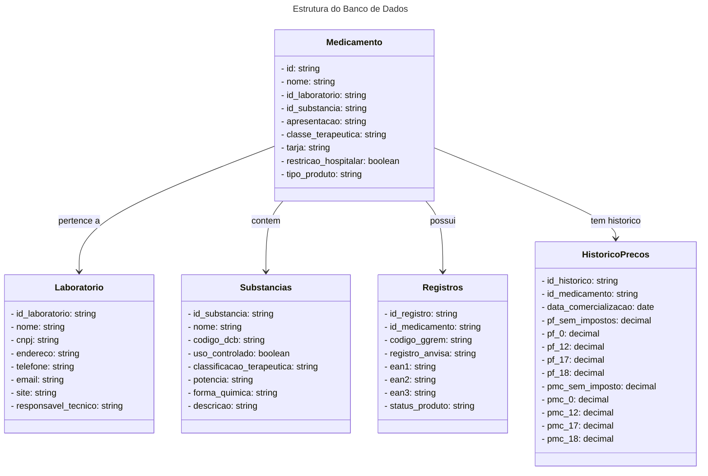

# API-CMED
A API-CMED fornece acesso ao histórico de preços de medicamentos no Brasil, facilitando consultas por nome ou registro. Atualizada regularmente com dados oficiais, permite filtragem por período e oferece respostas em JSON ou XML. Ideal para análises de mercado, pesquisas acadêmicas e desenvolvimento de aplicações relacionadas à saúde.

## 📖 Sumário

1. [Funcionalidades](#-funcionalidades)
2. [Tecnologias Utilizadas](#️-tecnologias-utilizadas)
3. [Estrutura do Banco de Dados](#-estrutura-do-banco-de-dados)
   - [Entidades e Relacionamentos](#-entidades-e-relacionamentos)
4. [Como Usar](#-como-usar)
   - [Instalação](#instalação)
   - [Configuração](#configuração)
   - [Endpoints](#endpoints)

## 💡 Funcionalidades

## 🛠️ Tecnologias Utilizadas

## 🔄 Estrutura do Banco de Dados

### 🔮 Entidades e Relacionamentos

## 📝 Como Usar

### Instalação

### Configuração

### Endpoints