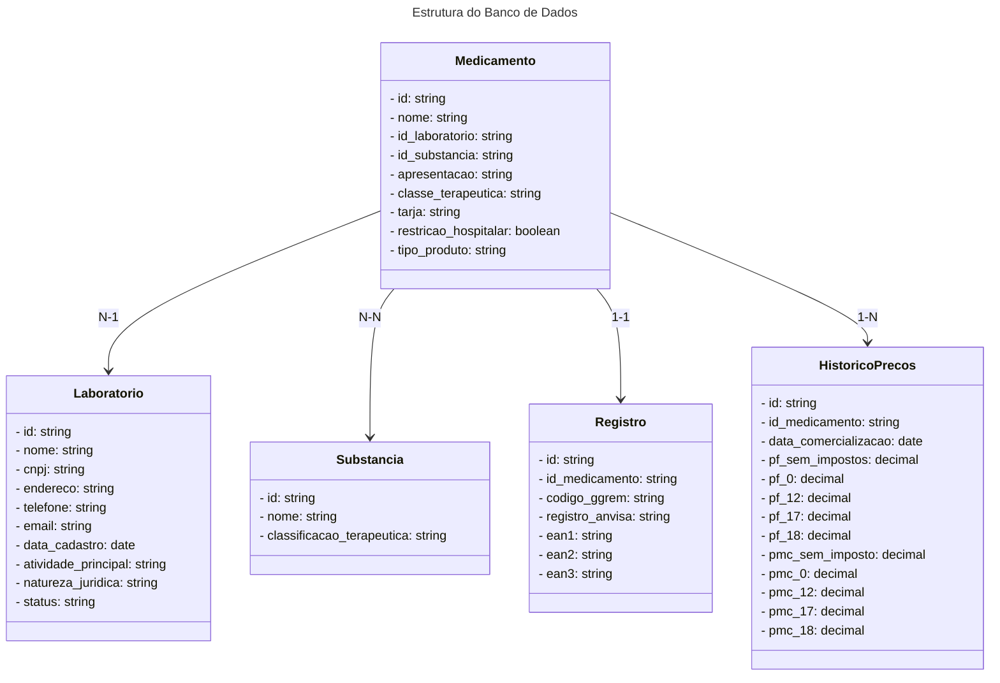

# API-CMED

A API-CMED fornece acesso ao histórico de preços de medicamentos no Brasil, facilitando consultas por nome ou registro. Atualizada regularmente com dados oficiais, permite filtragem por período e oferece respostas em JSON ou XML. Ideal para análises de mercado, pesquisas acadêmicas e desenvolvimento de aplicações relacionadas à saúde.

relatório: [Relatório Completo](RelarotioPersistencia4.pdf)

vídeo explicativo: https://www.youtube.com/watch?v=mR8gSRQh0bI

## 📖 Sumário

1. [Funcionalidades](#-funcionalidades)
2. [Tecnologias Utilizadas](#️-tecnologias-utilizadas)
3. [Estrutura do Banco de Dados](#-estrutura-do-banco-de-dados)
   - [Entidades e Relacionamentos](#-entidades-e-relacionamentos)
4. [Como Usar](#-como-usar)
   - [Instalação](#instalação)
   - [Configuração](#configuração)

## 💡 Funcionalidades
- Consulta de histórico de preços de medicamentos por nome ou registro.

- Filtragem de resultados, contagem, consultas paginadas, operações de crud nas entidades 

- Dados atualizados com informações oficiais do governo: https://www.gov.br/anvisa/pt-br/assuntos/medicamentos/cmed/precos/anos-anteriores/anos-anteriores.

## 🛠️ Tecnologias Utilizadas

fastapi, motor, bson, pandas, io, unidecode, datetime, typing

## 🔄 Estrutura do Banco de Dados

### 🔮 Entidades e Relacionamentos


```mermaid
---
title: Estrutura do Banco de Dados
---
classDiagram
class Medicamento {
    - id: string
    - nome: string
    - id_laboratorio: string
    - id_substancia: string
    - apresentacao: string
    - classe_terapeutica: string
    - tarja: string
    - restricao_hospitalar: boolean
    - tipo_produto: string
}

class Laboratorio {
    - id: string
    - nome: string
    - cnpj: string
    - endereco: string
    - telefone: string
    - email: string
    - data_cadastro: date
    - atividade_principal: string
    - natureza_juridica: string
    - status: string
}

class Registro {
    - id: string
    - id_medicamento: string
    - codigo_ggrem: string
    - registro_anvisa: string
    - ean1: string
    - ean2: string
    - ean3: string
}

class Substancia {
    - id: string
    - nome: string
    - classificacao_terapeutica: string
}

class HistoricoPrecos {
    - id: string
    - id_medicamento: string
    - data_comercializacao: date
    - pf_sem_impostos: decimal
    - pf_0: decimal
    - pf_12: decimal
    - pf_17: decimal
    - pf_18: decimal
    - pmc_sem_imposto: decimal
    - pmc_0: decimal
    - pmc_12: decimal
    - pmc_17: decimal
    - pmc_18: decimal
}

Medicamento --> Laboratorio: N-1
Medicamento --> Substancia: N-N
Medicamento --> Registro: 1-1
Medicamento --> HistoricoPrecos: 1-N

```

## 📝 Como Usar

### Instalação

1. Clone o repositório:

   ```bash
   git clone https://github.com/seuusuario/api-cmed.git
   cd api-cmed
   ```

2. Crie e ative um ambiente virtual (opcional):

   ```bash
   python -m venv venv
   source venv/bin/activate  # No Windows use: venv\Scripts\activate
   ```

3. Instale as dependências:

   ```bash
   pip install -r requirements.txt
   ```

### Configuração

1. Configure a conexão com o MongoDB no arquivo `.env`:
   ```env
   MONGO_URI=mongodb://localhost:27017/cmed
   ```
2. Inicie a API executando o comando dentro da pasta `api-cmed`:
   ```bash
   uvicorn app.main:app --reload
   ```

